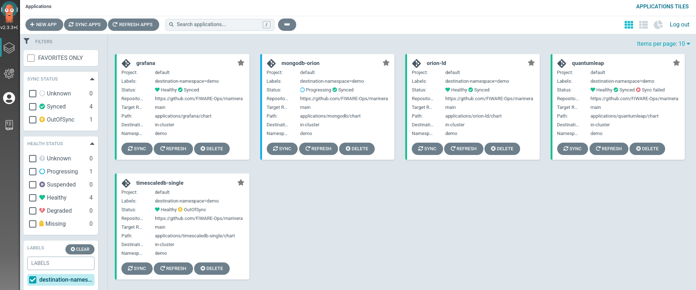

# Getting started

This repository contains all scripts required for deploying a FIWARE platform to run on an OpenShift cluster.

## Preconditions

Since this repository concentrates on deploying the platform, we require the underlying infrastructure to be already setup in a defined way. The listed preconditions have to be met and are constantly tested, but it might also work on comparable alternative setups.

**The following preconditions need to be fulfilled before starting :warning: :**

- [Red Hat OpenShift](https://www.redhat.com/en/technologies/cloud-computing/openshift) in >= 4.x installed - see [official documentation](https://docs.openshift.com/container-platform/latest/welcome/index.html) for installing it.
- [ArgoCD](https://argo-cd.readthedocs.io/en/stable/) >=2.3.x installed - multiple options are available:
    - [Install ArgoCD documentation](https://argo-cd.readthedocs.io/en/stable/getting_started/#1-install-argo-cd)
    - [Install using Argo CD Openshift Operator ](https://argocd-operator-helm.readthedocs.io/en/latest/ocp/ocp4.html)
    - [FIWARE installation documentation](https://github.com/FIWARE-Ops/fiware-gitops#4-install-argocd)
- [OpenShift CLI](https://docs.openshift.com/container-platform/4.10/cli_reference/openshift_cli/getting-started-cli.html) installed - see [installation documentation](https://docs.openshift.com/container-platform/4.10/cli_reference/openshift_cli/getting-started-cli.html#installing-openshift-cli)
- [Helm](https://helm.sh/docs/intro/install/) binary installed.
- [Sealed Secrets Controller](https://github.com/bitnami-labs/sealed-secrets#helm-chart) deployed and [Kubeseal](https://github.com/bitnami-labs/sealed-secrets/releases) binary installed. (Optional, only if sealed secrets)
- [Openshift Logging](./LOGGING.md) installed and configured.
- [Openshift User Workload Monitoring](./MONITORING.md) enabled.

> **NOTE:** A user with `cluster-admin` permissions is needed to install the ArgoCD operator.

## OpenShift user permissions

> **NOTE:** A certain understanding of how [OpenShift RBAC](https://docs.openshift.com/container-platform/4.10/authentication/using-rbac.html) works is required to understand this topic.

In order to be able to deploy FIWARE applications, an Openshift user needs:

1. To have permissions to manage ArgoCD applications, given by the role `applications.argoproj.io-v1alpha1-admin`. Usually this role is given only inside the namespace where ArgoCD runs.
2. To have permissions to create projects (if the projects are not already pre-created for him/her), given by the role `self-provisioner`.

So, we are gonna assume the user `alice` requires both permissions:
```bash
oc -n <ARGOCD_NAMESPACE> adm policy add-role-to-user applications.argoproj.io-v1alpha1-admin alice
oc adm policy add-cluster-role-to-user self-provisioner alice
```

## ArgoCD permissions

> **NOTE:** A certain understanding of how [OpenShift RBAC](https://docs.openshift.com/container-platform/4.10/authentication/using-rbac.html) works is required to understand this topic.

When using ArgoCD to deploy applications in the cluster, the ArgoCD service account `XXX-argocd-server` is basically deploying things on our behalf, meaning is this SA to whom we need to provide the right permissions to deploy our applications.

> **NOTE:** The ArgoCD SA name follows the pattern `<ARGOCD_INSTANCE_NAME>-argocd-server`, so if for example your ArgoCD instances is named "myargo", then the SA name would be `myargo-argocd-server`

When our applications are composed by only traditional OpenShift/K8s objects such as deployments, services or secrets, giving ArgoCD SA the `admin` role would be enough. But when our applications are composed by no so traditional objects such as Operators CRs like Prometheus `ServiceMonitors` or `PrometheuRules` (like some of the FIWARE apps do) then we need additional permissions.

We could be very granular and test ArgoCD with every app we deploy and see if the permissions are enough, otherwise look for the right role to be assigned, but this requires a trial and error approach, very time consuming.

In our case, as the number of applications deployed is substantial, and some of those are complex with many objects, we have decided to give the ArgoCD SA
the `cluster-admin` role, but at a namespace level. This may sound counterintuitive and feel like we are giving the ArgoCD SA root like access to the whole cluster, but that is not the case.

We are giving the ArgoCD SA root like access, but only at a certain namespaces, this way we don't need to study every application helm chart in advance, but at the same time, we are scoping the permissions to a certain namespace.

With the following command, we give the ArgoCD running in the namespace <ARGOCD_NAMESPACE> `cluster-admin` permissions in the namespace <PLATFORM_NAMESPACE>, meaning ArgoCD can deploy any object inside that namespace, but only in that namespace.

```bash
# get ArgoCD SA name
oc -n <ARGOCD_NAMESPACE> get sa | grep argocd-server

# Give the SA the right permissions
oc -n <PLATFORM_NAMESPACE> adm policy add-role-to-user cluster-admin system:serviceaccount:<ARGOCD_NAMESPACE>:<SA_NAME>
```
> **NOTE:** Remember to create your namespace <PLATFORM_NAMESPACE> before executing this command. See step [below](#5-create-the-target-namespace-inside-your-cluster).

## Installation steps

### 1. Fork the repo

To build and configure the platform using the [GitOps-Pattern](https://www.gitops.tech/), you should fork this repository to your own git.
On [github](github.com), follow the [fork-a-repo tutorial](https://docs.github.com/en/get-started/quickstart/fork-a-repo). For other git-installations, see the corresponding documentation. Now you can git-clone your own fork.

### 2. Decide which FIWARE applications to deploy

Go to `fiware-platform/values.yaml` and set the `enabled` value to either `true` or `false`.
For example, you can enable Orion-LD but disable Quantum Leap:
```yaml
applications:
  - name: orion-ld
    enabled: true
    source_path: applications/orion-ld/chart
    source_ref: *branch
    destination: *destination
    helm_values:
    - values.yaml
    values:
      orion-ld:
        myvalue: XXX

  - name: quantumleap
    enabled: false
    source_path: applications/quantumleap/chart
    source_ref: *branch
    destination: *destination
    helm_values:
    - values.yaml
```

> **NOTE:** \
By default each application is deployed with a sane set of default values that have been tested to work in most cases.
But this does not mean they are the right fit for a production ready deployment.
Please verify each application potential values (as all of them are Helm charts). You can either directly change the `values.yaml` of individual apps, or use the `values:` property directly in the app definition list in `fiware-platform/values.yaml` to override and/or set default values.

### 3. Decide if you want to use Sealed Secrets

By default, all passwords needed for the deployment are in plain text in the `values.yaml` file of each component. If you want to keep those secrets safe follow this [documentation](./SECRETS.md) and then continue from this point onward.

### 4. Set the repo url in the values.yaml

Since ArgoCD should now follow the new fork, instead of the original repository, you have to replace the ```source``` in `fiware-platform/values.yaml`.

This can be done with this one liner:
```shell
sed -i'' -e 's,source: https://github.com/FIWARE-Ops/marinera,source:  <FORK_URL>,g' fiware-platform/values.yaml
```

### 5. Create the target namespace inside your cluster

> **WARNING:** Make sure for the next steps that you are logged in to the cluster via ```oc login``` and that the account has enough permissions to create namespaces and create resources

The platform should be deployed to a namespace. Create the namespace via:
```shell
oc new-project <PLATFORM_NAMESPACE>
```
> **WARNING:** Depending on your ArgoCD deployment and configuration you may need to add the label `argocd.argoproj.io/managed-by:<ARGOCD_NAMESPACE>` to your `<PLATFORM_NAMESPACE>`
```shell
oc label namespace <PLATFORM_NAMESPACE> argocd.argoproj.io/managed-by=<ARGOCD_NAMESPACE>
```

### 6. Set the target namespace in the values.yaml

Similar to the ```source```, the ```destination``` namespace can be replaced.
This can be done with the following command:

```shell
sed -i'' -e 's/destination_namespace: \&destination demo/destination_namespace: \&destination <PLATFORM_NAMESPACE>/g' fiware-platform/values.yaml
```

### 7. Set the target branch in the values.yaml

Similar to the ```source```,, the ```branch``` can be replaced, so the ArgoCD apps will sync to that branch.
This can be done with the following command:

```shell
sed -i'' -e 's/branch: \&branch main/branch: \&branch <FORK_BRANCH>/g' fiware-platform/values.yaml
```

### 8. Set the target namespace as the name of the release in the values.yaml

Since all of your ArgoCD applications are going to live in the ArgoCD namespace, it is important to differentiate them with the name of the release, so a good strategy is to make it the name of the namespace you are deploying to:

```shell
sed -i'' -e 's/release: demo/release: <PLATFORM_NAMESPACE>/g' fiware-platform/values.yaml
```

### 9. Apply the applications to the cluster

Now that everything is prepared, we can deploy the FIWARE components chosen by creating the ArgoCD applications
and applying them to the cluster:
```bash
cd fiware-platform/
helm template . | oc -n <ARGOCD_NAMESPACE> apply -f -
```

This will create ArgoCD apps.




### 10. Uninstall the platform

If you want to uninstall the FIWARE platform, you just need to run the following commands:

> **CRITICAL:** Make sure you are in the correct namespace in the cluster and the name of the release inside `fiware-platform/values.yaml` is the one you are going to uninstall.

```bash
cd fiware-platform/
helm template . | oc -n <ARGOCD_NAMESPACE> delete -f -

oc delete project <PLATFORM_NAMESPACE>
```
