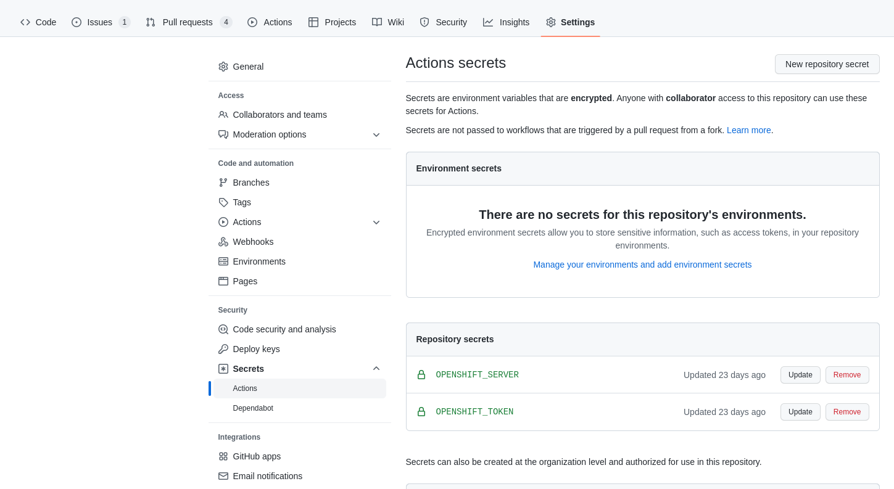

# Continuous Integration

[Continuos Integration (CI)](https://openpracticelibrary.com/practice/continuous-integration/) is a key practide of todays software development.

This repo is configured to work with [Github CI](https://docs.github.com/en/actions/automating-builds-and-tests/about-continuous-integration). You can find the CI workflows under the [.github/workflows](../.github/workflows/) folder, in the root folder of this repo.

The CI workflows basically create a new namespace based on any `feature-*` branch with the same name of the branch,
and deploy there the [fiware-platform](../fiware-platform/) helm chart, which governs all the components of the FIWARE platform. This is implemented creating an ArgoCD application per application defined in this repo.

In order for this to work, two Github actions secrets need to be set:

* `OPENSHIFT_SERVER`: API of the OpenShift cluster.
* `OPENSHIFT_TOKEN`: OpenShift service account token to perform the actions of the CI in the OpenShift cluster.



## OpenShift Server URL

In order to set the `OPENSHIFT_SERVER` Github secret, we can extract the OpenShift cluster server url directly from the cli.
```bash
 oc whoami --show-server
```

## OpenShift Service Account permissions

In order to set the `OPENSHIFT_TOKEN` Github secret, we first need to extract the token from an OpenShift service account with enough permissions to perform all the CI actions on top of the cluster.

In this case the CI workflows require:

* To create and delete OpenShift projects
* To create and delete ArgoCD applications.
* To assign role to OpenShift users and groups.
* To install some helm charts

It was decided to give the service account `cluster-admin`permissions. To do that, we have created a service account named
`github-ci` in our CI/CD namespace and give it the `cluster-admin` role, at cluster level.

```bash
oc -n <CI_CD_NAMESPACE> create sa github-ci
oc -n <CI_CD_NAMESPACE> adm policy add-cluster-role-to-user cluster-admin -z github-ci
```

To obtain the token.

```bash
oc -n <CI_CD_NAMESPACE> sa get-token github-ci
```

In case of OpenShift >= 4.11, use: 

```bash
oc create token github-ci -n <CI_CD_NAMESPACE> --duration 31536000s #this would be valid for a year
```
