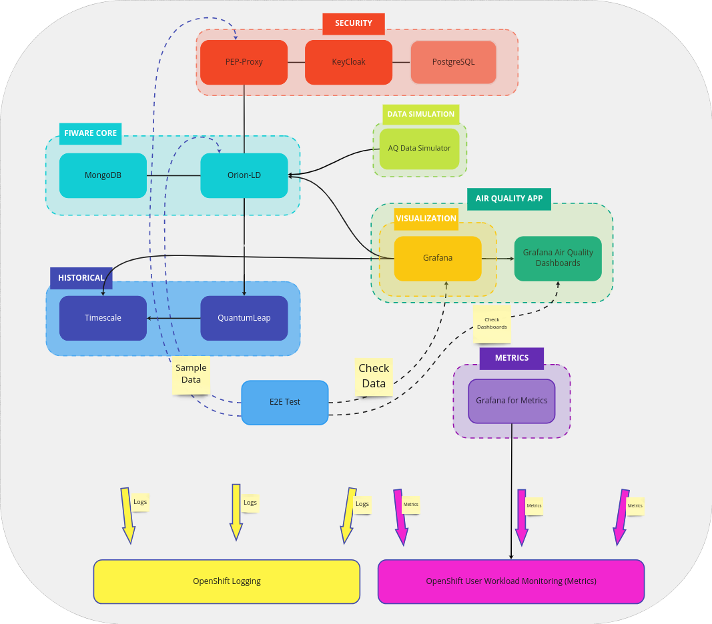

# Understanding FIWARE platform

Currently the FIWARE Platform is composed by the following components, being FIWARE core (Orion-LD + MongoDB) the only one mandatory.

> **NOTE:** Each component may contain more than one piece of software, usually an application plus a data base to store the state of the app.

* *FIWARE core*: [Orion-LD](https://fiware-academy.readthedocs.io/en/latest/core/orion-ld/index.html) plus MongoDB as backend. Provides the core FIWARE functionality.
* *Historical Data Layer*: [QuantumLeap](https://quantumleap.readthedocs.io/en/latest/) plus TimescaleDB. Provides historical data functionality.
* *Security Layer*: [Keycloak](https://www.keycloak.org/) plus PostgreSQL and the Policy Enforcement Point (PEP) proxy.
* *Air Quality App*: Grafana plus Air Quality dashboards.
* *Data Simulation Layer*: An application to simulate Air Quality data. To be used to showcase the Air Quality App when no real device data can be injected into the platform.
* *Metrics Layer*: Grafana with dashboards to display for Orion-LD metrics. Grafana connected to a Prometheus instance, in this case, the OpenShift Monitoring Prometheus instance.

Optionally we can consider the *E2E Tests* part of the platform. They assume certain components are deployed, depending on the test scenario run.

> **NOTE**: The deployment of this platform has been tested on an OpenShift 4.9.
